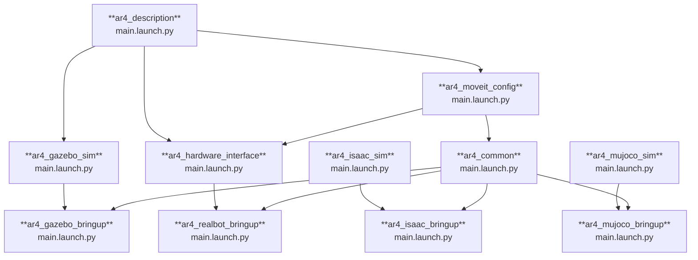

# AR4 ROS 2 Software

The [Annin Robotics AR4](https://www.anninrobotics.com/) robot is a 6DOF desktop size industrial robot that is a free, open plan low cost robot.

This package is a ROS 2 software stack for the AR4 robot. It contains both the necessary packages to control the robot in real hardware and in simulation environments based on [Gazebo](https://gazebosim.org/home), [Isaac Sim](https://docs.isaacsim.omniverse.nvidia.com/latest/index.html), and [MuJoCo](https://mujoco.org/).

https://github.com/user-attachments/assets/0edf4c30-70d1-4992-a5ee-e3e813877bb5


## Package summary

These are the main packages providing launch files for the different use cases:

- [`ar4_description`](./ar4_description): Contains the platform-agnostic parts of the URDF robot description.
- [`ar4_gazebo_bringup`](./ar4_gazebo): Launch a Gazebo Sim simulation of AR4.
- [`ar4_isaac_bringup`](./ar4_gazebo): **Not yet available.** Launch an Isaac Sim simulation of AR4.
- [`ar4_mujoco_bringup`](./ar4_gazebo): **Not yet available.** Launch a MuJoCo-based simulation of AR4.
- [`ar4_realbot_bringup`](./ar4_gazebo): Launch drivers and control software for the real AR4 robot.
- [`ar4_isaac`](./ar4_isaac): Isaac simulation for the ar4 arm.




## Prerequisites

You need a working ROS 2 environment to be able to build and run the packages in this repository. The exact details of the environment will depend on the specific package you are trying to run (realbot, Gazebo, Isaac Sim, or MuJoCo).

To help you get started and to provide a reference environment, we provide development docker images that contain all the necessary dependencies to run the contents of this repository.

To be able to use the development docker images, you need to have `docker` and `docker-compose` installed in your host machine.

You can find the Docker installation instructions for Ubuntu [here](https://docs.docker.com/engine/install/ubuntu/).

## Running on simulated environments

The AR4 robot can be run using different simulators. The following sections describe how to launch the AR4 robot in Gazebo, Isaac Sim, and MuJoCo.

### Gazebo

To run the AR4 robot in Gazebo Sim use the `ar4_gazebo` version of the development docker image.

```bash
./docker/run.sh -s ar4_gazebo --build
```

See further instructions in [the Gazebo bringup package README file](ar4_gazebo_bringup/README.md)


### Isaac sim

To run the AR4 robot in Isaac Sim use the `ar4_isaac` version of the development docker image.

```bash
./docker/run.sh -s ar4_isaac --build
```

See further instructions in [the Isaac Sim bringup package README file](ar4_isaac/README.md)


### MuJoCo

To run the AR4 robot in MuJoCo use the `ar4_mujoco` version of the development docker image.

```bash
./docker/run.sh -s ar4_mujoco --build
```

See further instructions in [the MuJoCo bringup package README file](ar4_mujoco_bringup/README.md)


## Using on real hardware

See further instructions in [the Realbot bringup package README file](ar4_realbot_bringup/README.md)

## Controlling the AR4 with MoveIt

To plan and command the arm to execute a motion, this launch file will also start MoveIt automatically. Once launched, you should see RViz showing the robot visualization and the MotionPlanning panel on the left.

There are two ways of selecting a target position for the arm using `RViz`:
1. Selecting a random valid position.
2. Moving the end effector to a desired position.


####  1. Selecting random valid position
This will select a random position for the arm that would not cause a collision with itself or objects around it, calculated from the semantic information of the robot.

[Random valid position video](https://github.com/user-attachments/assets/ec926968-8952-4ccf-ba63-5423e94f61cd)


###  2. Moving end effector to a desired position
This allows you to select a goal position for the end effector, which is currently the last link in the arm as no gripper is being used. This is done by dragging and dropping where the end effector should move to.

[User selected position video](https://github.com/user-attachments/assets/04dbb11c-bca4-4c05-95ae-251d70f41931)

## Attribution

This project builds upon excellent work from the ROS 2 community. We are grateful to the original authors who created the foundation for AR4 robot support in ROS 2.

The `ar4_description` and `ar4_hardware_interface` packages are derivative works based on the [ar4_ros_driver](https://github.com/ycheng517/ar4_ros_driver) repository by Dexter Ong and Yifei Cheng, providing the original URDF description, meshes, and hardware interface implementation for the AR4 robot in ROS 2.

The `ar4_moveit_config` package was generated using the [MoveIt2 Setup Assistant](https://moveit.picknik.ai/main/doc/examples/setup_assistant/setup_assistant_tutorial.html) and has been customized for this project's specific requirements.

## Licenses

Most packages in this repository are distributed under the **BSD 3-Clause License** (Copyright 2025, Ekumen Inc.).

The following packages have different licenses due to their derivative nature:

- **`ar4_description`**: MIT License (Copyright 2021, Dexter Ong) - Derivative work from [ar4_ros_driver](https://github.com/ycheng517/ar4_ros_driver)
- **`ar4_hardware_interface`**: MIT License (Copyright 2021, Dexter Ong) - Derivative work from [ar4_ros_driver](https://github.com/ycheng517/ar4_ros_driver)
- **`ar4_moveit_config`**: BSD 3-Clause License (Copyright 2025, Ekumen Inc.) - Generated and modified from MoveIt2 Setup Assistant templates

Please refer to the LICENSE file in each package directory for complete license terms.
