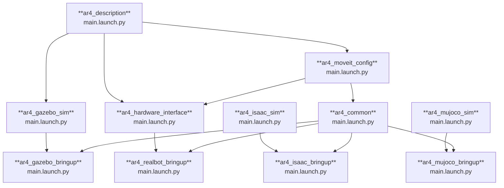

# AR4 ROS 2 Software

The [Annin Robotics AR4](https://www.anninrobotics.com/) is a 6-degree-of-freedom desktop-scale industrial robot designed as an open-source, low-cost robotic platform.

This repository provides a ROS 2 software stack for the AR4 robot, including packages for controlling the robot on real hardware and within simulation environments based on [Gazebo](https://gazebosim.org/home), [Isaac Sim](https://docs.isaacsim.omniverse.nvidia.com/latest/index.html), and [MuJoCo](https://mujoco.org/).

https://github.com/user-attachments/assets/0edf4c30-70d1-4992-a5ee-e3e813877bb5


## Package Summary

The following packages provide launch files for various deployment scenarios:

- [`ar4_description`](./ar4_description): Platform-agnostic URDF robot description.
- [`ar4_gazebo_bringup`](./ar4_gazebo): Gazebo simulation environment for the AR4.
- [`ar4_isaac_bringup`](./ar4_gazebo): **Not yet available.** Isaac Sim simulation environment for the AR4.
- [`ar4_mujoco_bringup`](./ar4_gazebo): **Not yet available.** MuJoCo-based simulation environment for the AR4.
- [`ar4_realbot_bringup`](./ar4_gazebo): Hardware drivers and control software for the physical AR4 robot.
- [`ar4_isaac`](./ar4_isaac): Isaac Sim integration for the AR4 manipulator.




## Prerequisites

A functional ROS 2 environment is required to build and execute the packages in this repository. Environment specifications vary depending on the target deployment (real hardware, Gazebo, Isaac Sim, or MuJoCo).

Development Docker images are provided to facilitate initial setup and serve as reference environments. These images include all necessary dependencies for the repository contents.

To utilize the development Docker images, `docker` and `docker-compose` must be installed on the host system.

Docker installation instructions for Ubuntu are available at: https://docs.docker.com/engine/install/ubuntu/

## Simulated Environments

The AR4 robot can be deployed in multiple simulation environments. The following sections describe the launch procedures for Gazebo, Isaac Sim, and MuJoCo.

### Gazebo

The AR4 robot can be executed in Gazebo Sim using the `ar4_gazebo` development Docker image.

```bash
./docker/run.sh -s ar4_gazebo --build
```

Additional instructions can be found in the [Gazebo bringup package README](ar4_gazebo_bringup/README.md).


### Isaac Sim

The AR4 robot can be executed in Isaac Sim using the `ar4_isaac` development Docker image.

```bash
./docker/run.sh -s ar4_isaac --build
```

Additional instructions can be found in the [Isaac Sim bringup package README](ar4_isaac/README.md).


### MuJoCo

The AR4 robot can be executed in MuJoCo using the `ar4_mujoco` development Docker image.

```bash
./docker/run.sh -s ar4_mujoco --build
```

Additional instructions can be found in the [MuJoCo bringup package README](ar4_mujoco_bringup/README.md).


## Real Hardware Deployment

Detailed instructions for real hardware deployment can be found in the [Realbot bringup package README](ar4_realbot_bringup/README.md).

## Motion Planning with MoveIt

MoveIt is automatically initialized by the launch files to enable motion planning and execution. Upon launch, RViz displays the robot visualization with the MotionPlanning panel.

Two methods are available for specifying target positions in RViz:
1. Selection of a random valid position.
2. Interactive positioning of the end effector.


#### 1. Random Valid Position Selection
A collision-free position for the manipulator is computed automatically based on the robot's semantic information.

[Random valid position video](https://github.com/user-attachments/assets/ec926968-8952-4ccf-ba63-5423e94f61cd)


#### 2. Interactive End Effector Positioning
The goal position for the end effector (currently the terminal link of the manipulator) can be specified interactively through drag-and-drop operations in the visualization.

[User selected position video](https://github.com/user-attachments/assets/04dbb11c-bca4-4c05-95ae-251d70f41931)

## Attribution

This project is based on prior work from the ROS 2 community. The foundation for AR4 robot support in ROS 2 was established by the original authors, whose contributions are acknowledged herein.

The `ar4_description` and `ar4_hardware_interface` packages are derived from the [ar4_ros_driver](https://github.com/ycheng517/ar4_ros_driver) repository by Dexter Ong and Yifei Cheng. The original repository provides the URDF description, mesh files, and hardware interface implementation for the AR4 robot in ROS 2.

The `ar4_moveit_config` package was generated using the [MoveIt2 Setup Assistant](https://moveit.picknik.ai/main/doc/examples/setup_assistant/setup_assistant_tutorial.html) and subsequently modified to meet the specific requirements of this project.

## Licenses

The majority of packages in this repository are distributed under the **BSD 3-Clause License** (Copyright 2025, Ekumen Inc.).

The following packages are distributed under different licenses due to their derivative nature:

- **`ar4_description`**: MIT License (Copyright 2021, Dexter Ong) - Derived from [ar4_ros_driver](https://github.com/ycheng517/ar4_ros_driver)
- **`ar4_hardware_interface`**: MIT License (Copyright 2021, Dexter Ong) - Derived from [ar4_ros_driver](https://github.com/ycheng517/ar4_ros_driver)
- **`ar4_moveit_config`**: BSD 3-Clause License (Copyright 2025, Ekumen Inc.) - Generated and modified from MoveIt2 Setup Assistant templates

Complete license terms can be found in the LICENSE file within each package directory.
